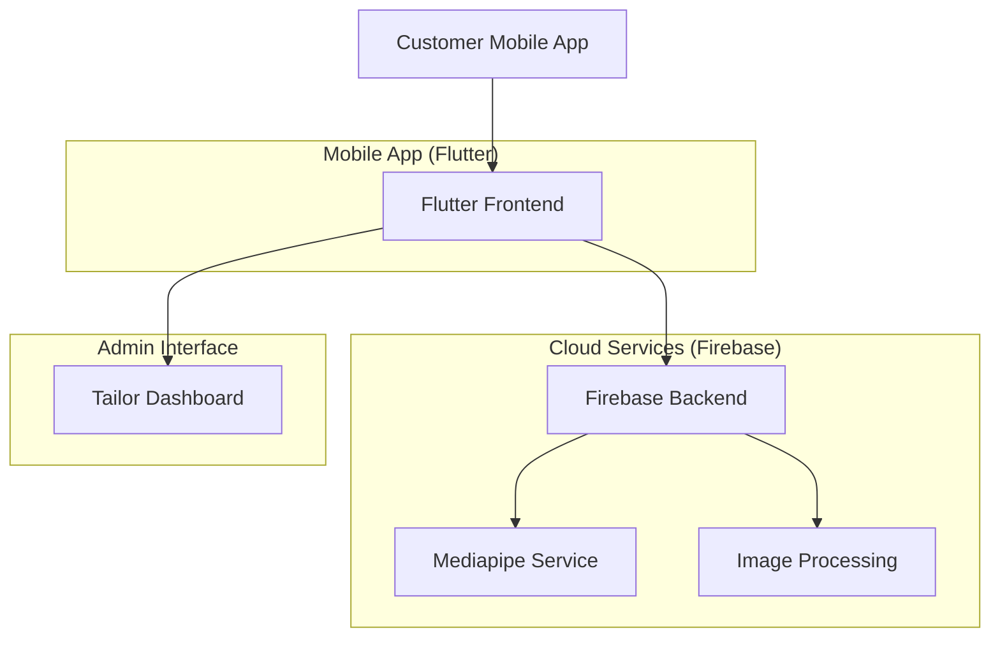
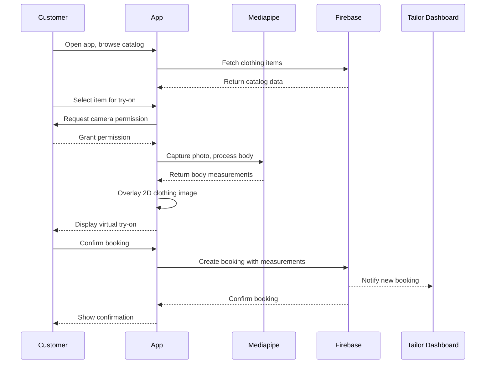
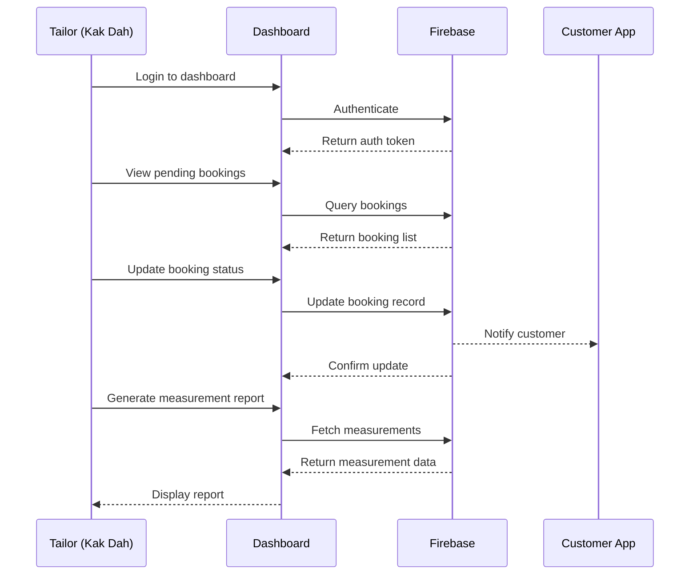

# Design Document: Fashion Try-On & Booking MVP

## Overview

Busana Prima is a minimum viable product (MVP) for a fashion try-on and booking platform targeting small tailor businesses. The MVP enables customers to virtually try on clothing using 2D-overlay AR, get body measurements via Mediapipe, and book tailoring appointments. The system provides a Tailor Dashboard for Kak Dah to manage orders, measurements, and appointments.

**Key Constraints & Trade-offs:**
- **8-week timeline**: Prioritized core booking system over advanced AR features
- **$0 budget**: Leveraged open-source libraries exclusively (Mediapipe, Flutter plugins)
- **Cross-platform**: Flutter for iOS/Android reach with single codebase
- **Simple AR**: 2D-overlay approach instead of 3D garment simulation for speed
- **Measurement accuracy**: Mediapipe provides "good enough" measurements for tailoring vs. professional 3D scanners

## Architecture



**Architecture Decisions:**
1. **Firebase Backend**: Chosen for zero-cost startup, real-time database, and authentication
2. **Client-side Mediapipe**: Runs on device to avoid server costs and latency
3. **2D Image Overlay**: Simpler than 3D garment simulation, works with existing clothing images
4. **Monolithic Flutter App**: Single codebase for customer app and tailor dashboard

## Sequence Diagrams

### Main Customer Flow: Virtual Try-On & Booking



### Tailor Management Flow



## Components and Interfaces

### Component 1: MeasurementService

**Purpose**: Handles body measurement extraction using Mediapipe

```dart
abstract class MeasurementService {
  /// Initialize Mediapipe and load models
  Future<void> initialize();
  
  /// Process image and extract body measurements
  Future<BodyMeasurements> measureFromImage(File image);
  
  /// Get measurement accuracy confidence (0.0 to 1.0)
  double get confidence;
  
  /// Clean up resources
  Future<void> dispose();
}

class MediapipeMeasurementService implements MeasurementService {
  // Implementation using Mediapipe Flutter plugin
}
```

**Responsibilities**:
- Load and manage Mediapipe models
- Process camera images for pose estimation
- Extract key body measurements (chest, waist, hips, etc.)
- Calculate measurement confidence scores

### Component 2: TryOnService

**Purpose**: Manages 2D clothing overlay on body images

```dart
abstract class TryOnService {
  /// Overlay clothing image on body image
  Future<File> overlayClothing({
    required File bodyImage,
    required File clothingImage,
    required BodyMeasurements measurements,
    required ClothingType clothingType,
  });
  
  /// Adjust overlay based on body measurements
  Future<File> adjustFit({
    required File overlayedImage,
    required BodyMeasurements measurements,
    required ClothingType clothingType,
  });
}

class Simple2DOverlayService implements TryOnService {
  // Implementation using image processing libraries
}
```

**Responsibilities**:
- Scale and position clothing images on body
- Apply basic transformations for fit visualization
- Handle different clothing types (shirt, pants, dress)

### Component 3: BookingService

**Purpose**: Manages appointment booking and order management

```dart
abstract class BookingService {
  /// Create a new booking with measurements
  Future<Booking> createBooking({
    required String customerId,
    required String clothingItemId,
    required BodyMeasurements measurements,
    required DateTime preferredDate,
    required String notes,
  });
  
  /// Get bookings for a customer
  Future<List<Booking>> getCustomerBookings(String customerId);
  
  /// Get bookings for a tailor
  Future<List<Booking>> getTailorBookings(String tailorId);
  
  /// Update booking status
  Future<Booking> updateBookingStatus({
    required String bookingId,
    required BookingStatus status,
    String? tailorNotes,
  });
}

class FirebaseBookingService implements BookingService {
  // Implementation using Firebase Firestore
}
```

**Responsibilities**:
- Create and manage booking records
- Handle booking status transitions
- Notify relevant parties of status changes

### Component 4: TailorDashboard

**Purpose**: Provides management interface for Kak Dah

```dart
abstract class TailorDashboard {
  /// Get dashboard summary statistics
  Future<DashboardSummary> getSummary(String tailorId);
  
  /// Get pending bookings requiring action
  Future<List<Booking>> getPendingBookings(String tailorId);
  
  /// Get measurement reports for bookings
  Future<List<MeasurementReport>> getMeasurementReports({
    required String tailorId,
    DateTime? startDate,
    DateTime? endDate,
  });
  
  /// Update work schedule/availability
  Future<void> updateAvailability({
    required String tailorId,
    required Schedule schedule,
  });
}
```

## Data Models

### Model 1: BodyMeasurements

```dart
class BodyMeasurements {
  final String id;
  final String customerId;
  final DateTime measuredAt;
  final double confidence; // 0.0 to 1.0
  
  // Key measurements (in cm)
  final double chest;
  final double waist;
  final double hips;
  final double shoulderWidth;
  final double armLength;
  final double legLength;
  final double height;
  
  // Additional notes
  final String? notes;
  final Map<String, double> additionalMeasurements;
  
  BodyMeasurements({
    required this.id,
    required this.customerId,
    required this.measuredAt,
    required this.confidence,
    required this.chest,
    required this.waist,
    required this.hips,
    required this.shoulderWidth,
    required this.armLength,
    required this.legLength,
    required this.height,
    this.notes,
    this.additionalMeasurements = const {},
  });
  
  /// Validate measurements are within reasonable ranges
  bool get isValid {
    return chest > 0 && chest < 200 &&
           waist > 0 && waist < 200 &&
           hips > 0 && hips < 200 &&
           confidence >= 0.5; // Minimum confidence threshold
  }
}
```

**Validation Rules**:
- All measurements must be positive numbers
- Confidence must be ≥ 0.5 for valid measurements
- Measurements must be within human physiological ranges

### Model 2: Booking

```dart
enum BookingStatus {
  pending,      // Created by customer, awaiting tailor review
  confirmed,    // Tailor confirmed appointment
  inProgress,   // Tailor working on garment
  ready,        // Garment ready for pickup/delivery
  completed,    // Customer received garment
  cancelled,    // Booking cancelled
}

class Booking {
  final String id;
  final String customerId;
  final String tailorId;
  final String clothingItemId;
  final BodyMeasurements measurements;
  final DateTime createdAt;
  final DateTime preferredDate;
  final DateTime? confirmedDate;
  final BookingStatus status;
  final String customerNotes;
  final String? tailorNotes;
  final double estimatedPrice;
  final double? finalPrice;
  
  Booking({
    required this.id,
    required this.customerId,
    required this.tailorId,
    required this.clothingItemId,
    required this.measurements,
    required this.createdAt,
    required this.preferredDate,
    this.confirmedDate,
    required this.status,
    required this.customerNotes,
    this.tailorNotes,
    required this.estimatedPrice,
    this.finalPrice,
  });
  
  /// Check if booking can transition to new status
  bool canTransitionTo(BookingStatus newStatus) {
    const validTransitions = {
      BookingStatus.pending: [BookingStatus.confirmed, BookingStatus.cancelled],
      BookingStatus.confirmed: [BookingStatus.inProgress, BookingStatus.cancelled],
      BookingStatus.inProgress: [BookingStatus.ready, BookingStatus.cancelled],
      BookingStatus.ready: [BookingStatus.completed, BookingStatus.cancelled],
      BookingStatus.completed: [],
      BookingStatus.cancelled: [],
    };
    
    return validTransitions[status]?.contains(newStatus) ?? false;
  }
}
```

**Validation Rules**:
- Booking must have valid measurements
- Status transitions must follow defined workflow
- Dates must be in chronological order

### Model 3: ClothingItem

```dart
enum ClothingType {
  shirt,
  pants,
  dress,
  skirt,
  jacket,
  custom,
}

class ClothingItem {
  final String id;
  final String name;
  final String description;
  final ClothingType type;
  final List<String> imageUrls;
  final double basePrice;
  final Map<String, double> sizeAdjustmentPrices; // Price adjustments per size
  final int estimatedProductionDays;
  final bool isAvailable;
  
  ClothingItem({
    required this.id,
    required this.name,
    required this.description,
    required this.type,
    required this.imageUrls,
    required this.basePrice,
    this.sizeAdjustmentPrices = const {},
    required this.estimatedProductionDays,
    required this.isAvailable,
  });
  
  /// Calculate price based on measurements
  double calculatePrice(BodyMeasurements measurements) {
    double price = basePrice;
    
    // Add size adjustment if applicable
    if (type == ClothingType.shirt || type == ClothingType.dress) {
      if (measurements.chest > 100) {
        price += sizeAdjustmentPrices['largeChest'] ?? 0;
      }
    }
    
    return price;
  }
}
```

## Algorithmic Pseudocode with Formal Specifications

### Main Algorithm: Body Measurement Extraction

```dart
/// Algorithm: extractBodyMeasurements
/// Input: image (File) - Front-facing body image
/// Output: BodyMeasurements - Extracted body measurements
/// Precondition: image is not null, contains human body in frontal pose
/// Postcondition: Returns valid BodyMeasurements with confidence ≥ 0.5 or throws MeasurementError
/// Loop Invariants: All processed landmarks maintain spatial consistency

Future<BodyMeasurements> extractBodyMeasurements(File image) async {
  // PRECONDITION: Validate input
  assert(image != null, "Image must not be null");
  assert(await image.exists(), "Image file must exist");
  
  // Step 1: Initialize Mediapipe if not already done
  if (!_isInitialized) {
    await _initializeMediapipe();
  }
  
  // Step 2: Process image through Mediapipe
  final poseLandmarks = await _mediapipe.processImage(image);
  
  // Step 3: Validate pose detection quality
  if (poseLandmarks.confidence < 0.7) {
    throw MeasurementError(
      "Pose detection confidence too low: ${poseLandmarks.confidence}",
    );
  }
  
  // Step 4: Extract key measurements from landmarks
  final measurements = BodyMeasurements(
    id: generateId(),
    customerId: _currentCustomerId,
    measuredAt: DateTime.now(),
    confidence: poseLandmarks.confidence,
    
    // Calculate measurements from landmark distances
    chest: _calculateChestCircumference(poseLandmarks),
    waist: _calculateWaistCircumference(poseLandmarks),
    hips: _calculateHipCircumference(poseLandmarks),
    shoulderWidth: _calculateShoulderWidth(poseLandmarks),
    armLength: _calculateArmLength(poseLandmarks),
    legLength: _calculateLegLength(poseLandmarks),
    height: _calculateHeight(poseLandmarks),
  );
  
  // POSTCONDITION: Validate output
  assert(measurements.isValid, "Extracted measurements must be valid");
  assert(measurements.confidence >= 0.5, "Confidence must be ≥ 0.5");
  
  return measurements;
}
```

### Algorithm: 2D Clothing Overlay

```dart
/// Algorithm: overlayClothingOnBody
/// Input: bodyImage, clothingImage, measurements, clothingType
/// Output: File - Combined image with clothing overlay
/// Precondition: Both images exist, measurements are valid
/// Postcondition: Output image contains properly scaled clothing overlay
/// Loop Invariants: Image transformation matrices maintain aspect ratio

Future<File> overlayClothingOnBody({
  required File bodyImage,
  required File clothingImage,
  required BodyMeasurements measurements,
  required ClothingType clothingType,
}) async {
  // PRECONDITION: Validate inputs
  assert(await bodyImage.exists(), "Body image must exist");
  assert(await clothingImage.exists(), "Clothing image must exist");
  assert(measurements.isValid, "Measurements must be valid");
  
  // Step 1: Load and decode images
  final bodyImg = await decodeImage(bodyImage);
  final clothingImg = await decodeImage(clothingImage);
  
  // Step 2: Calculate scaling factors based on body measurements
  final scaleFactors = _calculateScaleFactors(
    measurements: measurements,
    clothingType: clothingType,
  );
  
  // Step 3: Scale clothing image proportionally
  final scaledClothing = _scaleImage(
    clothingImg,
    scaleFactors.width,
    scaleFactors.height,
  );
  
  // Step 4: Position clothing on body (simple 2D overlay)
  final positionedClothing = _positionOnBody(
    scaledClothing,
    bodyImg,
    clothingType: clothingType,
  );
  
  // Step 5: Blend images with transparency
  final resultImage = _blendImages(
    bodyImg,
    positionedClothing,
    opacity: 0.7, // 70% opacity for try-on effect
  );
  
  // Step 6: Save result
  final outputFile = await _saveImage(resultImage);
  
  // POSTCONDITION: Validate output
  assert(await outputFile.exists(), "Output file must exist");
  assert((await outputFile.length()) > 0, "Output file must not be empty");
  
  return outputFile;
}
```

## Key Functions with Formal Specifications

### Function 1: createBooking()

```dart
/// Creates a new booking with body measurements
/// 
/// Preconditions:
/// - customerId must be a valid, authenticated user ID
/// - clothingItemId must reference an existing, available clothing item
/// - measurements must be valid (isValid == true)
/// - preferredDate must be in the future
/// - notes must not be empty
/// 
/// Postconditions:
/// - Returns a Booking object with status = BookingStatus.pending
/// - Booking is persisted to Firebase Firestore
/// - Tailor is notified of new booking
/// - No side effects on input parameters
/// 
/// Error Conditions:
/// - Throws ArgumentError if preconditions not met
/// - Throws FirebaseException if persistence fails

Future<Booking> createBooking({
  required String customerId,
  required String clothingItemId,
  required BodyMeasurements measurements,
  required DateTime preferredDate,
  required String notes,
}) async {
  // Validate preconditions
  if (customerId.isEmpty) {
    throw ArgumentError('customerId must not be empty');
  }
  if (clothingItemId.isEmpty) {
    throw ArgumentError('clothingItemId must not be empty');
  }
  if (!measurements.isValid) {
    throw ArgumentError('measurements must be valid');
  }
  if (preferredDate.isBefore(DateTime.now())) {
    throw ArgumentError('preferredDate must be in the future');
  }
  if (notes.trim().isEmpty) {
    throw ArgumentError('notes must not be empty');
  }
  
  // Fetch clothing item to calculate price
  final clothingItem = await _clothingRepository.get(clothingItemId);
  if (clothingItem == null || !clothingItem.isAvailable) {
    throw ArgumentError('Clothing item not available');
  }
  
  // Calculate estimated price
  final estimatedPrice = clothingItem.calculatePrice(measurements);
  
  // Create booking object
  final booking = Booking(
    id: generateId(),
    customerId: customerId,
    tailorId: 'kak_dah', // Hardcoded for MVP
    clothingItemId: clothingItemId,
    measurements: measurements,
    createdAt: DateTime.now(),
    preferredDate: preferredDate,
    status: BookingStatus.pending,
    customerNotes: notes,
    estimatedPrice: estimatedPrice,
  );
  
  // Persist to Firebase
  await _firestore.collection('bookings').doc(booking.id).set(booking.toMap());
  
  // Notify tailor (simplified for MVP)
  await _sendNotification(
    to: 'kak_dah',
    title: 'New Booking',
    body: 'New booking from $customerId',
  );
  
  return booking;
}
```

### Function 2: updateBookingStatus()

```dart
/// Updates booking status with proper workflow enforcement
/// 
/// Preconditions:
/// - bookingId must reference an existing booking
/// - newStatus must be a valid status transition from current status
/// - tailorNotes optional but required for certain status changes
/// - Caller must be authenticated as the assigned tailor
/// 
/// Postconditions:
/// - Returns updated Booking object
/// - Booking status is updated in persistence layer
/// - Customer is notified of status change if applicable
/// - Audit trail is maintained
/// 
/// Loop Invariants:
/// - Status transition validation maintains workflow integrity
/// - Notification logic consistent across all transitions

Future<Booking> updateBookingStatus({
  required String bookingId,
  required BookingStatus newStatus,
  String? tailorNotes,
}) async {
  // Fetch current booking
  final booking = await _bookingRepository.get(bookingId);
  if (booking == null) {
    throw ArgumentError('Booking not found');
  }
  
  // Validate status transition
  if (!booking.canTransitionTo(newStatus)) {
    throw StateError(
      'Invalid status transition: ${booking.status} -> $newStatus',
    );
  }
  
  // Validate tailor notes for certain transitions
  if (newStatus == BookingStatus.cancelled && 
      (tailorNotes == null || tailorNotes.trim().isEmpty)) {
    throw ArgumentError('Cancellation requires explanation');
  }
  
  // Update booking
  final updatedBooking = booking.copyWith(
    status: newStatus,
    tailorNotes: tailorNotes,
    confirmedDate: newStatus == BookingStatus.confirmed 
        ? DateTime.now() 
        : booking.confirmedDate,
  );
  
  // Persist changes
  await _bookingRepository.update(updatedBooking);
  
  // Notify customer if status change is customer-facing
  if (_shouldNotifyCustomer(newStatus)) {
    await _sendCustomerNotification(
      booking.customerId,
      'Booking Status Updated',
      'Your booking status is now: ${newStatus.name}',
    );
  }
  
  return updatedBooking;
}
```

## Example Usage

```dart
// Example 1: Complete customer flow
void exampleCustomerFlow() async {
  // Customer browses catalog
  final catalogService = CatalogService();
  final clothingItems = await catalogService.getAvailableItems();
  
  // Selects item for try-on
  final selectedItem = clothingItems.first;
  
  // Takes body measurement photo
  final measurementService = MediapipeMeasurementService();
  await measurementService.initialize();
  
  final imageFile = await _takePhoto();
  final measurements = await measurementService.measureFromImage(imageFile);
  
  // Try on virtually
  final tryOnService = Simple2DOverlayService();
  final tryOnImage = await tryOnService.overlayClothing(
    bodyImage: imageFile,
    clothingImage: File(selectedItem.imageUrls.first),
    measurements: measurements,
    clothingType: selectedItem.type,
  );
  
  // Display try-on result
  await _displayImage(tryOnImage);
  
  // Book appointment
  final bookingService = FirebaseBookingService();
  final booking = await bookingService.createBooking(
    customerId: 'customer_123',
    clothingItemId: selectedItem.id,
    measurements: measurements,
    preferredDate: DateTime.now().add(Duration(days: 7)),
    notes: 'Please make sleeve length 2cm longer',
  );
  
  print('Booking created: ${booking.id}');
}

// Example 2: Tailor dashboard usage
void exampleTailorDashboard() async {
  // Tailor logs in
  final authService = AuthenticationService();
  await authService.login('kak_dah@busanaprima.com', 'password');
  
  // View dashboard
  final dashboard = TailorDashboard();
  final summary = await dashboard.getSummary('kak_dah');
  
  print('Pending bookings: ${summary.pendingCount}');
  print('This week\'s revenue: \$${summary.weeklyRevenue}');
  
  // Process pending bookings
  final pendingBookings = await dashboard.getPendingBookings('kak_dah');
  
  for (final booking in pendingBookings) {
    // Review measurements
    final report = await dashboard.getMeasurementReports(
      tailorId: 'kak_dah',
      startDate: DateTime.now().subtract(Duration(days: 30)),
    );
    
    // Confirm booking
    final bookingService = FirebaseBookingService();
    await bookingService.updateBookingStatus(
      bookingId: booking.id,
      newStatus: BookingStatus.confirmed,
      tailorNotes: 'Measurements look good, will start work on Monday',
    );
  }
}
```

## Correctness Properties

### Universal Quantification Statements

1. **Measurement Accuracy Property**: 
   ```
   ∀ measurement ∈ BodyMeasurements • measurement.confidence ≥ 0.5 ⇒ 
     measurement.isValid ∧ measurement.chest ∈ (30, 200) ∧ measurement.waist ∈ (20, 150)
   ```

2. **Booking Workflow Property**:
   ```
   ∀ booking ∈ Booking • booking.canTransitionTo(newStatus) ⇒
     ∃ validTransition ∈ StatusTransitions[booking.status] • 
       newStatus ∈ validTransition
   ```

3. **Price Calculation Property**:
   ```
   ∀ clothingItem ∈ ClothingItem • ∀ measurement ∈ BodyMeasurements •
     clothingItem.calculatePrice(measurement) ≥ clothingItem.basePrice
   ```

4. **Image Processing Property**:
   ```
   ∀ inputImage ∈ File • ∀ outputImage ∈ File •
     overlayClothingOnBody(inputImage, ...) = outputImage ⇒
       outputImage.exists() ∧ outputImage.size > 0 ∧
       preservesAspectRatio(inputImage, outputImage)
   ```

## Error Handling

### Error Scenario 1: Low Measurement Confidence

**Condition**: Mediapipe returns confidence < 0.5 for body measurements
**Response**: Show user guidance to retake photo with better lighting/pose
**Recovery**: Allow unlimited retries, provide pose guidance overlay

### Error Scenario 2: Network Connectivity Issues

**Condition**: Firebase operations fail due to network errors
**Response**: Cache operations locally, show offline mode indicator
**Recovery**: Auto-retry when connectivity restored, sync pending operations

### Error Scenario 3: Invalid Status Transition

**Condition**: Tailor tries to move booking to invalid status
**Response**: Show error message explaining valid transitions
**Recovery**: Maintain current status, provide workflow guidance

### Error Scenario 4: Image Processing Failures

**Condition**: 2D overlay fails due to image corruption or size
**Response**: Fall back to side-by-side comparison view
**Recovery**: Allow manual adjustment of overlay position

## Testing Strategy

### Unit Testing Approach

**MeasurementService Tests**:
- Mock Mediapipe responses for various body types
- Test measurement extraction accuracy with known reference images
- Validate confidence scoring logic

**BookingService Tests**:
- Test status transition validation
- Verify Firebase persistence operations
- Test notification logic for status changes

**TryOnService Tests**:
- Test image scaling maintains aspect ratio
- Verify overlay positioning for different clothing types
- Test error handling for corrupt images

### Property-Based Testing Approach

**Property Test Library**: `fast-check` for Dart

**Key Properties to Test**:
1. **Measurement Invariance**: Scaling input image should not affect measurements beyond tolerance
2. **Booking Idempotence**: Applying same status transition twice should have no effect
3. **Price Monotonicity**: Larger measurements should not decrease price for same clothing item
4. **Image Processing Composition**: Multiple transformations should be associative

### Integration Testing Approach

**End-to-End Flows**:
1. Complete customer booking flow with mock camera
2. Tailor dashboard workflow with simulated bookings
3. Offline/online synchronization testing
4. Cross-platform consistency (iOS vs Android)

## Performance Considerations

### Measurement Processing Optimization
- **Lazy loading**: Mediapipe models loaded only when needed
- **Image compression**: Reduce image size before processing
- **Caching**: Cache measurement results for same customer

### Firebase Cost Optimization
- **Query efficiency**: Use composite indexes for common queries
- **Data denormalization**: Duplicate key data to avoid joins
- **Batch operations**: Group Firestore writes

### Mobile Performance
- **60 FPS target**: Ensure smooth UI animations
- **Memory management**: Dispose image resources promptly
- **Background processing**: Offload heavy computations

## Security Considerations

### Data Protection
- **Measurement data**: Encrypt at rest, anonymize where possible
- **Customer PII**: Store minimal personal information
- **Payment data**: Not handled in MVP (cash-only transactions)

### Authentication & Authorization
- **Firebase Auth**: Leverage built-in authentication
- **Role-based access**: Separate customer vs tailor permissions
- **Session management**: Automatic token refresh

### Image Privacy
- **Local processing**: Body images processed on-device when possible
- **Transient storage**: Delete temporary images after processing
- **User consent**: Explicit permission for camera usage

## Dependencies

### Core Flutter Dependencies
```yaml
dependencies:
  flutter:
    sdk: flutter
  
  # Mediapipe for body measurements
  mediapipe: ^0.1.0  # Flutter plugin for Mediapipe
  
  # Firebase services
  firebase_core: ^2.24.2
  firebase_auth: ^4.16.0
  cloud_firestore: ^4.15.0
  firebase_storage: ^11.5.0
  
  # Image processing
  image: ^4.1.4
  image_picker: ^1.0.4
  camera: ^0.10.6
  
  # State management
  provider: ^6.1.1
  riverpod: ^2.4.9
  
  # UI components
  flutter_svg: ^2.0.9
  cached_network_image: ^3.3.0
  
  # Utilities
  intl: ^0.18.1
  uuid: ^3.0.7
```

### Development Dependencies
```yaml
dev_dependencies:
  flutter_test:
    sdk: flutter
  
  # Testing
  mockito: ^5.4.2
  fast_check: ^0.1.0  # Property-based testing
  
  # Code quality
  flutter_lints: ^3.0.1
  very_good_analysis: ^5.0.0
```

### Open-Source Services
1. **Mediapipe**: Apache 2.0 license, Google's ML solution for pose estimation
2. **Firebase**: Google's BaaS with generous free tier
3. **Flutter Community Plugins**: MIT/Apache 2.0 licensed

## Trade-offs Summary

### Made to Meet 8-Week Deadline:
1. **2D vs 3D AR**: Chose simple 2D overlay instead of complex 3D garment simulation
2. **Measurement Accuracy**: Accepted "good enough" Mediapipe measurements vs professional 3D scanners
3. **Payment Integration**: Deferred to cash-only transactions to avoid PCI compliance complexity
4. **Multi-tailor Support**: Single tailor (Kak Dah) hardcoded for MVP
5. **Garment Customization**: Basic size adjustments only, no fabric/color customization

### Made for $0 Budget:
1. **Firebase Free Tier**: Limited to 1GB storage, 50K reads/day - sufficient for MVP
2. **Client-side Processing**: Mediapipe runs on device to avoid server costs
3. **Open-Source Only**: No paid libraries or services
4. **Simple Hosting**: Firebase Hosting for web dashboard (free tier)

### Technical Trade-offs:
1. **Flutter Web Limitations**: Tailor dashboard uses Flutter Web with some performance trade-offs
2. **Mediapipe Mobile Size**: ~30MB app size increase for ML models
3. **Firebase Vendor Lock-in**: Easy start but migration complexity later
4. **Offline Support**: Basic caching only, no full offline mode

This design provides a viable MVP that can be built within 8 weeks with $0 budget while delivering core value: virtual try-on, body measurements, and booking management for Kak Dah's tailoring business.