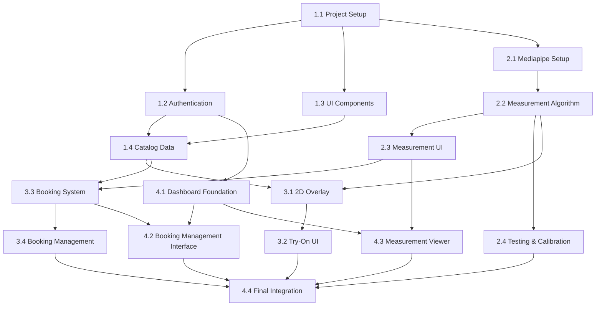

# Task Plan: Fashion Try-On & Booking MVP

## Overview

This task plan outlines the 8-week development schedule for the Busana Prima MVP. The plan is organized by sprints (2 weeks each) with clear deliverables and acceptance criteria.

**Total Timeline**: 8 weeks (4 sprints of 2 weeks each)
**Budget**: $0 (open-source only)
**Team**: Assumed 1-2 developers
**Technology Stack**: Flutter/Dart, Firebase, Mediapipe

## Sprint Planning

### Sprint 1: Foundation & Authentication (Weeks 1-2)

**Goal**: Set up project structure, authentication, and basic UI framework

#### Week 1 Tasks

**Task 1.1: Project Setup & Configuration**
- Initialize Flutter project with proper structure
- Configure Firebase project and services
- Set up development environment and tooling
- Create basic app architecture (state management, routing)
- **Estimate**: 2 days
- **Dependencies**: None
- **Acceptance Criteria**:
  - Flutter project runs on iOS and Android simulators
  - Firebase project configured with Authentication and Firestore
  - Basic app structure with clean architecture patterns
  - All dependencies properly versioned in pubspec.yaml

**Task 1.2: User Authentication Implementation**
- Implement Firebase Authentication integration
- Create login/registration screens
- Set up user profile management
- Implement role-based access (customer vs tailor)
- **Estimate**: 3 days
- **Dependencies**: Task 1.1
- **Acceptance Criteria**:
  - Users can register with email/password
  - Users can login and maintain session
  - Tailor admin access properly restricted
  - Error handling for auth failures

**Task 1.3: Basic UI Component Library**
- Create reusable Flutter widgets
- Implement app theme and design system
- Set up navigation structure
- Create basic screens framework
- **Estimate**: 2 days
- **Dependencies**: Task 1.1
- **Acceptance Criteria**:
  - Consistent design system across app
  - Reusable components for buttons, cards, forms
  - Proper navigation between screens
  - Responsive design for different screen sizes

#### Week 2 Tasks

**Task 1.4: Clothing Catalog Data Model**
- Define Firestore data structure for clothing items
- Create CRUD operations for catalog management
- Implement basic catalog browsing UI
- Set up image storage in Firebase Storage
- **Estimate**: 3 days
- **Dependencies**: Task 1.1, Task 1.2
- **Acceptance Criteria**:
  - Clothing items stored in Firestore with proper schema
  - Images uploaded and retrieved from Firebase Storage
  - Basic catalog browsing screen functional
  - Admin can add/edit clothing items

**Task 1.5: Sprint 1 Integration & Testing**
- Integrate all week 1-2 components
- Write unit tests for core functionality
- Perform basic user testing
- Fix critical issues
- **Estimate**: 2 days
- **Dependencies**: All Sprint 1 tasks
- **Acceptance Criteria**:
  - All Sprint 1 features work together
  - Unit test coverage > 70% for core modules
  - No critical bugs blocking basic flow
  - App builds and runs on both platforms

**Sprint 1 Deliverables**:
- Working authentication system
- Basic app structure and UI framework
- Clothing catalog browsing
- Firebase backend integration

### Sprint 2: Measurement System (Weeks 3-4)

**Goal**: Implement body measurement capture using Mediapipe

#### Week 3 Tasks

**Task 2.1: Mediapipe Integration Setup**
- Integrate Mediapipe Flutter plugin
- Configure pose estimation models
- Set up camera permission handling
- Create camera capture interface
- **Estimate**: 3 days
- **Dependencies**: Task 1.1
- **Acceptance Criteria**:
  - Mediapipe successfully integrated into Flutter project
  - Camera permissions properly requested and handled
  - Basic camera preview functional
  - Pose estimation model loads without errors

**Task 2.2: Body Measurement Algorithm**
- Implement landmark detection from Mediapipe output
- Calculate body measurements from landmarks
- Create measurement validation logic
- Implement confidence scoring
- **Estimate**: 4 days
- **Dependencies**: Task 2.1
- **Acceptance Criteria**:
  - Key measurements extracted: chest, waist, hips, etc.
  - Confidence scores calculated (0.0 to 1.0)
  - Measurements validated against physiological ranges
  - Algorithm handles edge cases (poor lighting, partial body)

#### Week 4 Tasks

**Task 2.3: Measurement UI & User Flow**
- Create measurement guidance screens
- Implement photo capture and retake flow
- Display measurement results with confidence
- Add measurement history storage
- **Estimate**: 3 days
- **Dependencies**: Task 2.1, Task 2.2
- **Acceptance Criteria**:
  - Clear user guidance for proper measurement pose
  - Photo capture with countdown/instructions
  - Results displayed in understandable format
  - Measurements saved to user profile

**Task 2.4: Measurement Testing & Calibration**
- Test measurement accuracy with reference images
- Calibrate algorithm for local population
- Implement manual measurement override
- Create measurement quality feedback
- **Estimate**: 2 days
- **Dependencies**: Task 2.2, Task 2.3
- **Acceptance Criteria**:
  - Measurement accuracy ≥ 80% compared to manual
  - Calibration factors adjustable if needed
  - Users can manually adjust measurements
  - Quality feedback helps improve future measurements

**Sprint 2 Deliverables**:
- Functional body measurement system
- Camera integration with Mediapipe
- Measurement storage and history
- Calibrated measurement algorithm

### Sprint 3: Try-On & Booking (Weeks 5-6)

**Goal**: Implement virtual try-on and booking system

#### Week 5 Tasks

**Task 3.1: 2D Image Overlay System**
- Implement image processing for clothing overlay
- Create scaling algorithms based on measurements
- Develop positioning logic for different clothing types
- Add transparency and blending effects
- **Estimate**: 4 days
- **Dependencies**: Task 2.2, Task 1.4
- **Acceptance Criteria**:
  - Clothing images overlay on body images
  - Scaling proportional to body measurements
  - Different positioning for shirts, pants, dresses
  - Adjustable opacity for try-on effect

**Task 3.2: Try-On User Interface**
- Create try-on screen with before/after views
- Implement clothing selection for try-on
- Add save/share functionality for try-on images
- Create try-on history gallery
- **Estimate**: 3 days
- **Dependencies**: Task 3.1
- **Acceptance Criteria**:
  - Intuitive try-on interface
  - Multiple clothing items can be tried on
  - Try-on images can be saved locally
  - History of previous try-ons accessible

#### Week 6 Tasks

**Task 3.3: Booking System Implementation**
- Define booking data model in Firestore
- Implement booking creation workflow
- Create date selection and scheduling
- Add notes and special requests handling
- **Estimate**: 3 days
- **Dependencies**: Task 1.4, Task 2.3
- **Acceptance Criteria**:
  - Bookings created with all required data
  - Date selection restricts to future dates
  - Notes properly attached to bookings
  - Booking confirmation with reference number

**Task 3.4: Booking Management & Notifications**
- Implement booking status tracking
- Create booking cancellation logic
- Set up Firebase Cloud Messaging for notifications
- Add local notifications for status changes
- **Estimate**: 2 days
- **Dependencies**: Task 3.3
- **Acceptance Criteria**:
  - Booking status follows defined workflow
  - Customers can cancel pending bookings
  - Notifications sent for status changes
  - Offline notification queue functional

**Sprint 3 Deliverables**:
- Virtual try-on with 2D overlay
- Complete booking system
- Notification system
- Integrated measurement-to-booking flow

### Sprint 4: Tailor Dashboard & Polish (Weeks 7-8)

**Goal**: Implement tailor dashboard and final polish

#### Week 7 Tasks

**Task 4.1: Tailor Dashboard Foundation**
- Create Flutter Web project for dashboard
- Implement tailor authentication and authorization
- Build dashboard layout and navigation
- Create summary statistics display
- **Estimate**: 3 days
- **Dependencies**: Task 1.2, Task 3.3
- **Acceptance Criteria**:
  - Tailor can login to web dashboard
  - Dashboard shows key statistics
  - Navigation between dashboard sections
  - Responsive design for desktop/tablet

**Task 4.2: Booking Management Interface**
- Implement booking list with filtering
- Create booking detail view with measurements
- Add status update functionality
- Implement tailor notes and pricing
- **Estimate**: 4 days
- **Dependencies**: Task 4.1, Task 3.3
- **Acceptance Criteria**:
  - All bookings visible with filtering options
  - Full booking details accessible
  - Status updates follow workflow rules
  - Tailor notes and pricing saved properly

#### Week 8 Tasks

**Task 4.3: Measurement Viewer & Reporting**
- Create measurement visualization interface
- Implement measurement comparison tools
- Generate basic measurement reports
- Add export functionality for reports
- **Estimate**: 2 days
- **Dependencies**: Task 4.1, Task 2.3
- **Acceptance Criteria**:
  - Measurements displayed visually
  - Comparison between different measurements
  - Basic reports generated
  - Reports exportable as PDF/image

**Task 4.4: Final Integration & Testing**
- Integrate all components end-to-end
- Perform comprehensive testing
- Fix bugs and polish UI
- Prepare for deployment
- **Estimate**: 3 days
- **Dependencies**: All previous tasks
- **Acceptance Criteria**:
  - Complete customer flow functional
  - Tailor dashboard fully operational
  - Cross-platform testing passed
  - Performance meets requirements
  - Ready for production deployment

**Sprint 4 Deliverables**:
- Complete tailor dashboard
- Measurement reporting tools
- Fully integrated system
- Production-ready application

## Task Dependencies Graph

## Resource Requirements

### Development Resources
- **Flutter Development Environment**: Android Studio/VS Code with Flutter SDK
- **Firebase Account**: For backend services (free tier)
- **Testing Devices**: iOS and Android physical devices or simulators
- **Mediapipe Models**: Downloaded during build process

### Human Resources
- **Flutter Developer**: Primary development (8 weeks full-time)
- **UI/UX Designer**: Part-time for design guidance (2 weeks)
- **QA Tester**: Part-time for testing (2 weeks)
- **Tailor (Kak Dah)**: User feedback and requirements validation

### External Resources
- **Open-Source Libraries**: As specified in dependencies
- **Documentation**: Flutter, Firebase, Mediapipe documentation
- **Community Support**: Flutter and Firebase communities for issue resolution

## Risk Mitigation Tasks

### RT1: Measurement Accuracy Risk Mitigation
- **Task**: Implement manual measurement override
- **When**: Week 4 (Task 2.4)
- **Effort**: 1 day
- **Success Criteria**: Users can adjust measurements if automatic ones are inaccurate

### RT2: Performance Optimization
- **Task**: Profile and optimize slow operations
- **When**: Week 8 (Task 4.4)
- **Effort**: 2 days
- **Success Criteria**: All operations meet performance requirements

### RT3: Offline Functionality
- **Task**: Implement basic offline caching
- **When**: Week 6 (Task 3.4)
- **Effort**: 1 day
- **Success Criteria**: Core functions work without network

### RT4: Cross-Platform Testing
- **Task**: Comprehensive platform testing
- **When**: Week 8 (Task 4.4)
- **Effort**: 2 days
- **Success Criteria**: Consistent experience on iOS and Android

## Quality Assurance Tasks

### QA1: Unit Testing
- **Coverage Target**: 80% for core business logic
- **Framework**: Flutter Test
- **Schedule**: Each sprint includes testing tasks
- **Responsible**: Development team

### QA2: Integration Testing
- **Scope**: End-to-end user flows
- **Framework**: Flutter Driver/Integration Test
- **Schedule**: Sprint 3 and 4
- **Responsible**: QA tester

### QA3: User Acceptance Testing
- **Participants**: Kak Dah and potential customers
- **Scope**: Complete application workflow
- **Schedule**: Week 7-8
- **Responsible**: Product owner

### QA4: Performance Testing
- **Metrics**: App size, launch time, operation speed
- **Tools**: Flutter DevTools, Firebase Performance Monitoring
- **Schedule**: Week 8
- **Responsible**: Development team

## Deployment Tasks

### DT1: App Store Preparation
- **Task**: Create app store listings
- **When**: Week 8
- **Effort**: 2 days
- **Deliverables**: App store assets, descriptions, screenshots

### DT2: Firebase Deployment
- **Task**: Deploy Firebase services
- **When**: Week 8
- **Effort**: 1 day
- **Deliverables**: Production Firebase project, security rules

### DT3: Dashboard Hosting
- **Task**: Deploy Flutter Web dashboard
- **When**: Week 8
- **Effort**: 1 day
- **Deliverables**: Hosted web dashboard, custom domain if needed

### DT4: Documentation
- **Task**: Create user and admin documentation
- **When**: Week 8
- **Effort**: 2 days
- **Deliverables**: User guide, admin manual, troubleshooting guide

## Success Metrics Tracking

### SM1: Development Metrics
- **Burndown Rate**: Track task completion vs timeline
- **Bug Count**: Monitor open vs closed bugs
- **Test Coverage**: Maintain > 80% coverage
- **Performance Benchmarks**: Regular performance testing

### SM2: Product Metrics
- **Measurement Accuracy**: Weekly validation against reference
- **User Flow Completion**: Track drop-off points in user testing
- **App Performance**: Monitor launch time and operation speed
- **Crash Reports**: Firebase Crashlytics integration

### SM3: Business Metrics
- **Booking Conversion**: Track try-on to booking conversion rate
- **User Satisfaction**: Simple in-app feedback mechanism
- **Tailor Efficiency**: Time saved vs manual process
- **System Uptime**: Firebase monitoring dashboard

## Contingency Plan

### If Behind Schedule (1-2 weeks):
- Reduce scope: Remove advanced try-on features
- Simplify UI: Use more standard Flutter components
- Defer enhancements: Postpone non-essential features

### If Measurement Accuracy Insufficient:
- Implement manual measurement input as primary
- Use Mediapipe as guidance only
- Add more detailed measurement instructions

### If Firebase Limits Exceeded:
- Optimize data usage: Reduce image sizes, cache aggressively
- Implement data cleanup: Archive old data
- Consider migration plan: Prepare for paid tier or alternative

### If User Adoption Low:
- Simplify onboarding: Reduce steps for first booking
- Add incentives: Discount for digital bookings
- Improve guidance: Better tutorials and help

## Weekly Checkpoints

### Week 2 Checkpoint:
- ✅ Authentication working
- ✅ Basic app structure
- ✅ Firebase integration
- ⚠️ Any blocking issues identified

### Week 4 Checkpoint:
- ✅ Body measurement functional
- ✅ Camera integration working
- ✅ Measurement accuracy validated
- ⚠️ Try-on complexity assessment

### Week 6 Checkpoint:
- ✅ Virtual try-on working
- ✅ Booking system functional
- ✅ Notifications implemented
- ⚠️ Dashboard progress status

### Week 8 Checkpoint:
- ✅ Tailor dashboard complete
- ✅ End-to-end testing passed
- ✅ Performance requirements met
- ✅ Ready for deployment

## Notes & Assumptions

### Development Assumptions:
- Developer familiar with Flutter and Firebase
- Access to both iOS and Android testing devices
- Stable internet connection for development
- Basic design assets provided or created

### Business Assumptions:
- Kak Dah available for weekly feedback sessions
- Basic clothing images available for catalog
- Willingness to test with real customers
- No legal/regulatory barriers to digital measurements

### Technical Assumptions:
- Mediapipe Flutter plugin stable and maintained
- Firebase free tier sufficient for MVP scale
- Flutter Web adequate for dashboard needs
- No major breaking changes in dependencies

This task plan provides a realistic 8-week schedule for delivering the Busana Prima MVP within the $0 budget constraint, with appropriate trade-offs and risk mitigation strategies.